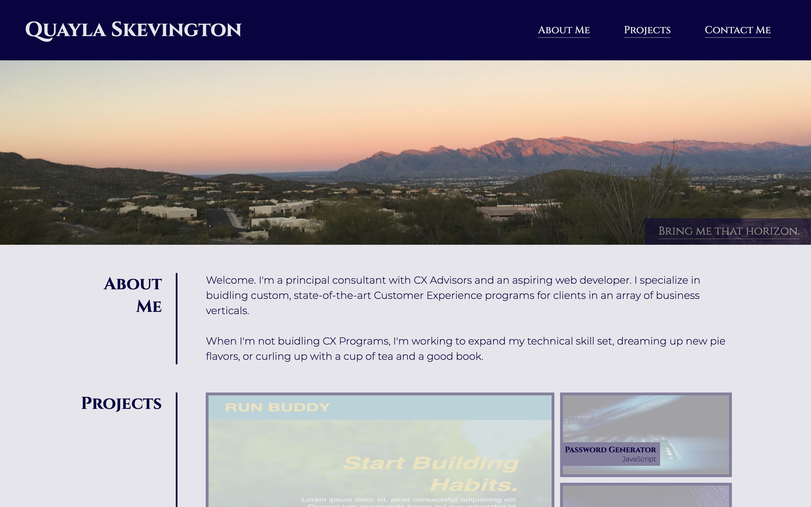
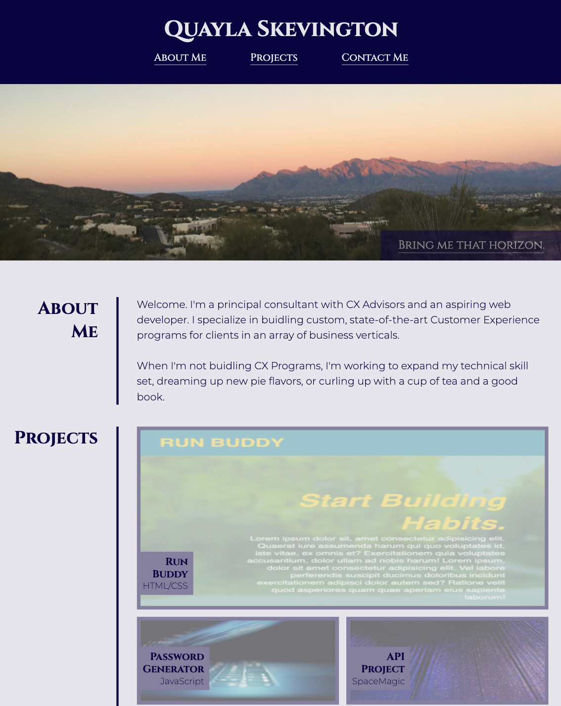
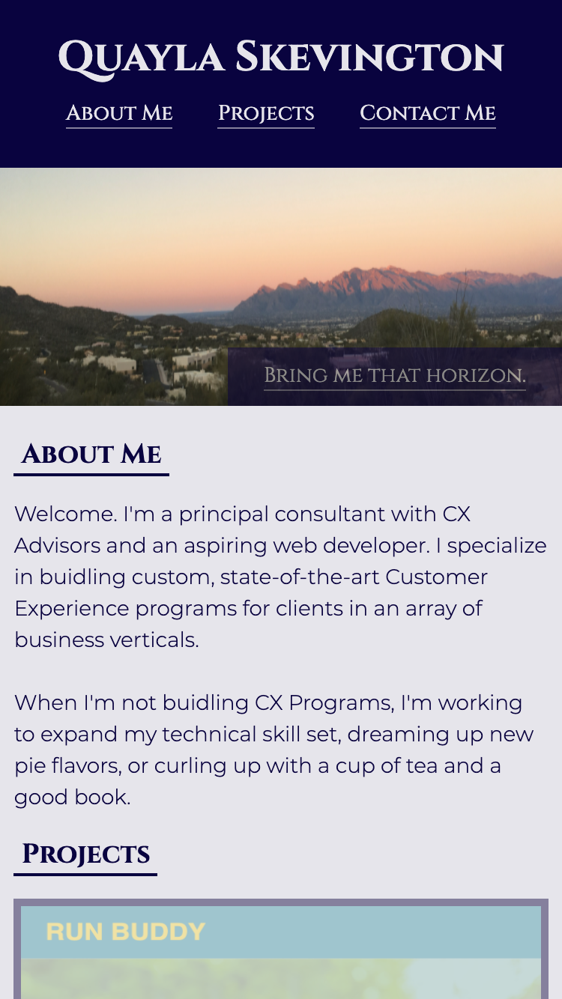

# Challenge 2: Portfolio | QS

For this week's challenge, we developed a personal web development portfolio from scratch. 

Table of Contents
* [User Story and Acceptance Criteria](#user-story-and-acceptance-criteria)
* [Key Features](#key-features)
* [Future Improvements](#future-improvements)
* [Images](#images)

---

## User Story and Acceptance Criteria

### User Story

```
AS AN employer
I WANT to view a potential employee's deployed portfolio of work samples
SO THAT I can review samples of their work and assess whether they're a good candidate for an open position
```

### Acceptance Criteria

```
WHEN I load their portfolio
THEN I am presented with the developer's name, a recent photo, and links to sections about them, their work, and how to contact them
```
```
WHEN I click one of the links in the navigation
THEN the UI scrolls to the corresponding section
```
```
WHEN I click on the link to the section about their work
THEN the UI scrolls to a section with titled images of the developer's applications
```
```
WHEN I am presented with the developer's first application
THEN that application's image should be larger in size than the others
```
```
WHEN I click on the images of the applications
THEN I am taken to that deployed application
```
```
WHEN I resize the page or view the site on various screens and devices
THEN I am presented with a responsive layout that adapts to my viewport
```

---

## Key Features

* Responsive layout leveraging Flexbox and CSS Grid
* Mobile queries to allow reformatting from columns to rows for mobile devices
* Embedded links to deployed applications

---
## Future Improvements

Currently, this portfolio links only to one deployed application. Additionall appliications will be linked in as they become available.

---
## Images
### Desktop View

1440px X 1112px



### iPad View

768px X 1024px



### iPhone 6 View

375px X 667px

